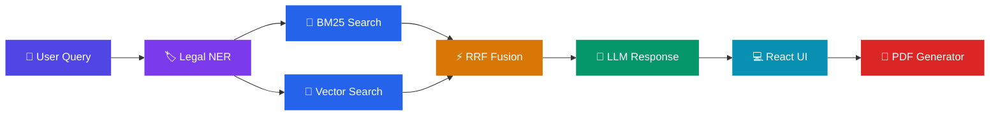

<div align="center">

# ⚖️ AI-Powered Legal Rights Awareness Chatbot


### 🔍 Hybrid RAG + Legal NER System for Accessible Legal Information

*A chatbot that uses **Hybrid Retrieval-Augmented Generation (RAG)**, **Legal Named Entity Recognition (NER)**, and **LLMs** to explain legal rights in plain language, retrieve accurate legal sections, generate formal legal notices, and provide referrals to legal aid organizations.*

> ⚠️ **Disclaimer:** This system provides **legal information**, not legal advice. Consult a qualified lawyer for your specific situation.

---

</div>

## ✨ Features

| | Feature | Description |
|:-:|---------|------------|
| 🔎 | **Hybrid Retrieval** | BM25 keyword search + ChromaDB vector semantic search with Reciprocal Rank Fusion (RRF) |
| 🏷️ | **Legal NER** | Extracts statutes, sections, amounts, penalties, and courts from queries and responses |
| 💬 | **Plain Language** | LLM translates complex legal jargon to 8th-grade reading level |
| 📄 | **PDF Generator** | 6 templates — eviction, deposit, rent, consumer grievance, defective product, refund |
| 🤖 | **Dual LLM** | Google Gemini or Anthropic Claude, auto-detected from environment |
| 🏛️ | **Legal Aid** | NALSA, e-Daakhil, DLSA, Tele-Law, Consumer Helpline, SHRC referrals |
| 🌐 | **Multilingual** | English and Hindi support |

---

## 📚 Legal Domains (MVP)

<div align="center">

| 🏠 Tenant Rights | 🛒 Consumer Rights | ⚖️ General Laws |
|:-:|:-:|:-:|
| Rent disputes | Defective products | Cyber crime |
| Security deposits | Refunds | Employment |
| Eviction rules | Complaints | Traffic & family law |

</div>

---

## 🛠️ Tech Stack

<div align="center">

| Layer | Technology | Badge |
|:-----:|------------|:-----:|
| **Frontend** | React 19, Tailwind CSS 3, React Router, Axios |   |
| **Backend** | FastAPI, Uvicorn |  |
| **RAG** | BM25, ChromaDB, Sentence Transformers |  |
| **NER** | Regex-based extraction (+ optional spaCy) |  |
| **LLM** | Google Gemini / Anthropic Claude |  |
| **PDF** | ReportLab + Jinja2 |  |
| **Database** | SQLite (SQLAlchemy) |  |

</div>

---

## 🚀 Installation & Setup

### Prerequisites

>   

### Step 1 — Clone

```bash
git clone https://github.com/adyaomnkar/AI_Law_Advisor.git
cd AI_Law_Advisor
```

### Step 2 — Environment Variables

```bash
cp .env.example .env
```

Edit `.env` and add your API key:

```env
# Add ONE of these (auto-detected):
GEMINI_API_KEY=your-gemini-api-key
# OR
ANTHROPIC_API_KEY=your-anthropic-api-key
```

> 💡 Get a free Gemini API key from [Google AI Studio](https://aistudio.google.com/apikey)

### Step 3 — Backend

```bash
cd backend
pip install -r requirements.txt
python main.py
```

> 🟢 Backend runs on `http://localhost:8000`
> 📦 First startup downloads a ~79MB embedding model (cached after that)

### Step 4 — Frontend

Open a **new terminal**:

```bash
cd frontend
npm install
npm start
```

> 🟢 Frontend runs on `http://localhost:3000`

---

## ⚙️ How It Works



1. 🧑 User asks a legal question
2. 🏷️ System extracts legal entities (sections, statutes, amounts)
3. 🔎 Hybrid search finds relevant provisions using BM25 + ChromaDB
4. ⚡ Results are fused using Reciprocal Rank Fusion
5. 🤖 LLM generates a plain-language response with citations
6. 📄 User can generate a formal legal notice PDF

---

## 🌐 API Endpoints

| Method | Endpoint | Description |
|:------:|----------|-------------|
|  | `/` | Health check, LLM provider status |
|  | `/api/chat` | Send query, get legal response with entities & sources |
|  | `/api/search` | Search legal documents |
|  | `/api/generate-pdf` | Generate legal notice PDF |
|  | `/api/legal-aid` | Get legal aid services list |
|  | `/api/sessions` | Get chat history |

---

## 🎯 Demo

<div align="center">

> 💬 **"I bought a fridge and it broke the next day. The shop refuses to refund my 20,000 rupees."**

</div>

| Step | What Happens |
|:----:|-------------|
| 🏷️ **Identifies** | Product → Fridge, Amount → ₹20,000, Issue → Defective Product |
| 📖 **Retrieves** | Consumer Protection Act sections |
| 💬 **Explains** | Rights in plain language with actionable steps |
| 📄 **Generates** | Refund Request legal notice PDF |

---

## 📁 Project Structure

```
AI_Law_Advisor/
│
├── 🔧 backend/
│   ├── main.py                 # FastAPI app, routes
│   ├── config.py               # Environment config, LLM detection
│   ├── llm_service.py          # Dual LLM (Gemini/Claude)
│   ├── pdf_generator.py        # Legal notice PDF generation
│   ├── requirements.txt
│   ├── database/db.py          # SQLite database
│   ├── rag_pipeline/
│   │   └── hybrid_search.py    # BM25 + ChromaDB + RRF
│   ├── ner/legal_ner.py        # Legal entity extraction
│   └── templates/
│       └── legal_notice.html   # Jinja2 template
│
├── 🎨 frontend/src/
│   ├── App.js
│   ├── context/ChatContext.js
│   ├── services/api.js
│   ├── pages/
│   │   ├── ChatPage.js
│   │   ├── LegalAidPage.js
│   │   └── AboutPage.js
│   └── components/
│       ├── Navbar.js
│       ├── ChatInput.js
│       ├── ChatMessage.js
│       ├── WelcomeScreen.js
│       ├── PDFGenerator.js
│       ├── DomainSelector.js
│       ├── EntityBadge.js
│       └── Disclaimer.js
│
├── 📚 data/
│   ├── tenant_rights.txt
│   ├── consumer_protection.txt
│   └── general_laws.txt
│
├── .env.example
└── .gitignore
```

---

<div align="center">

### 📜 License

**MIT License** — free to use and modify

---

*Built to bridge the access-to-justice gap* ⚖️

</div>
