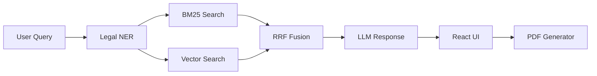

<div align="center">


# AI-Powered Legal Rights Awareness Chatbot


**Hybrid RAG + Legal NER System for Accessible Legal Information**


---

*A chatbot that uses **Hybrid Retrieval-Augmented Generation (RAG)**, **Legal Named Entity Recognition (NER)**, and **LLMs** to explain legal rights in plain language, retrieve accurate legal sections, generate formal legal notices, and provide referrals to legal aid organizations.*

> **Disclaimer:** This system provides **legal information**, not legal advice. Consult a qualified lawyer for your specific situation.

</div>

---

##  Features

| Feature | Description |
|---------|------------|
| **Hybrid Retrieval** | BM25 keyword search + ChromaDB vector semantic search with Reciprocal Rank Fusion (RRF) |
| **Legal NER** | Extracts statutes, sections, amounts, penalties, and courts from queries and responses |
| **Plain Language** | LLM translates complex legal jargon to 8th-grade reading level |
| **PDF Generator** | 6 templates — eviction, deposit, rent, consumer grievance, defective product, refund |
| **Dual LLM** | Google Gemini or Anthropic Claude, auto-detected from environment |
| **Legal Aid** | NALSA, e-Daakhil, DLSA, Tele-Law, Consumer Helpline, SHRC referrals |
| **Multilingual** | English and Hindi support |

---

##  Legal Domains (MVP)

```
 Tenant Rights       Consumer Rights       General Laws
  Rent disputes        Defective products     Cyber crime
  Security deposits    Refunds                Employment
  Eviction rules       Complaints             Traffic & family law
```

---

##  Tech Stack

<div align="center">

| Layer | Technology |
|:-----:|:----------:|
|  | React 19, Tailwind CSS 3, React Router, React Markdown, Axios |
|  | FastAPI, Uvicorn |
|  | BM25 (rank-bm25), ChromaDB, Sentence Transformers |
|  | Regex-based extraction (+ optional spaCy) |
|  | Google Generative AI / Anthropic Claude |
|  | ReportLab + Jinja2 |
|  | SQLite (SQLAlchemy) |

</div>

---

##  Installation & Setup

### Prerequisites

```
 Python 3.10+     Node.js 18+     npm
```

### 1. Clone the Repository

```bash
git clone https://github.com/adyaomnkar/AI_Law_Advisor.git
cd AI_Law_Advisor
```

### 2. Setup Environment Variables

```bash
cp .env.example .env
```

Edit `.env` and add your API key:

```env
# Add ONE of these (auto-detected):
GEMINI_API_KEY=your-gemini-api-key
# OR
ANTHROPIC_API_KEY=your-anthropic-api-key
```

Get a free Gemini API key from [Google AI Studio](https://aistudio.google.com/apikey).

### 3. Install & Start Backend

```bash
cd backend
pip install -r requirements.txt
python main.py
```

> Backend runs on `http://localhost:8000`
> First startup downloads a ~79MB embedding model for ChromaDB (cached after that).

### 4. Install & Start Frontend

```bash
cd frontend
npm install
npm start
```

> Frontend runs on `http://localhost:3000`

---

##  How It Works



1. User asks a legal question
2. System extracts legal entities (sections, statutes, amounts)
3. Hybrid search finds relevant provisions using BM25 + ChromaDB
4. Results are fused using Reciprocal Rank Fusion
5. LLM generates a plain-language response with citations
6. User can generate a formal legal notice PDF

---

##  API Endpoints

| Method | Endpoint | Description |
|:------:|----------|-------------|
| `GET` | `/` | Health check, LLM provider status |
| `POST` | `/api/chat` | Send query, get legal response with entities & sources |
| `POST` | `/api/search` | Search legal documents |
| `POST` | `/api/generate-pdf` | Generate legal notice PDF |
| `GET` | `/api/legal-aid` | Get legal aid services list |
| `GET` | `/api/sessions` | Get chat history |

---

##  Demo

**Query:**
> "I bought a fridge and it broke the next day. The shop refuses to refund my 20,000 rupees."

**System Response:**
- Identifies: Product (Fridge), Amount (Rs. 20,000), Issue (Defective Product)
- Retrieves: Consumer Protection Act sections
- Explains rights in plain language with actionable steps
- Option to generate a Refund Request legal notice PDF

---

## Project Structure

```
AI_Law_Advisor/
├── backend/
│   ├── main.py                 # FastAPI app, routes
│   ├── config.py               # Environment config, LLM detection
│   ├── llm_service.py          # Dual LLM service (Gemini/Claude)
│   ├── pdf_generator.py        # Legal notice PDF generation
│   ├── requirements.txt
│   ├── database/
│   │   └── db.py               # SQLite database
│   ├── rag_pipeline/
│   │   └── hybrid_search.py    # BM25 + ChromaDB + RRF
│   ├── ner/
│   │   └── legal_ner.py        # Legal entity extraction
│   └── templates/
│       └── legal_notice.html   # Jinja2 HTML template
│
├── frontend/
│   └── src/
│       ├── App.js
│       ├── context/ChatContext.js
│       ├── services/api.js
│       ├── pages/
│       │   ├── ChatPage.js
│       │   ├── LegalAidPage.js
│       │   └── AboutPage.js
│       └── components/
│           ├── Navbar.js
│           ├── ChatInput.js
│           ├── ChatMessage.js
│           ├── WelcomeScreen.js
│           ├── PDFGenerator.js
│           ├── DomainSelector.js
│           ├── EntityBadge.js
│           └── Disclaimer.js
│
├── data/
│   ├── tenant_rights.txt
│   ├── consumer_protection.txt
│   └── general_laws.txt
│
├── .env.example
└── .gitignore
```

---

<div align="center">

## License

MIT License


*Built for accessible justice*

</div>
